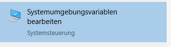
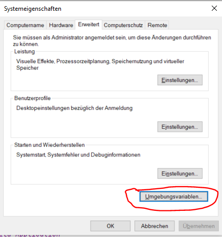

# Agrirouter Telemetry Converter

## What is this tool?
This tool converts [gps:info](https://github.com/DKE-Data/agrirouter-interface-documentation/blob/develop/docs/tmt/gps.adoc) and [efdi:timelog](https://github.com/DKE-Data/agrirouter-interface-documentation/blob/develop/docs/tmt/efdi.adoc#iso11783-10time_logprotobuf---efdi-timelog) packages as received via [agrirouter](https://my-agrirouter.com/en/); e.g. via [IO-Tool](https://io.my-agrirouter.com) to CSV files

## Who's the developer?


Development by [dev4Agriculture](https://www.dev4Agriculture.de)


## Setting up the app as a command line tool

To be able to call the tool from every location, add it to the PATH Variable

### Windows

Call Start and search for "Environment Variables"



Click "Change Environment Variables"



Select "PATH" and add {{the root folder of this project}}/apps

Click OK, close the window. Open cmd and type

````shell
ar_telemetry_converter -v
````

You should receive a version output

````shell
V1.1_2021-05-06
````


## CommandLine

The tool can be called with different parameters:

### Parameters 

Description of Parameters:
* -h: Print the help (basically this file)
* -v: Print the version
* -i: Is followed by the input file
* -o: Is followed by the output file or path
* -s: Is followed by the settings file
* -fi: Is followed by the Input format:
    * GPS: A .bin file including gps:info protobuf messages
    * EFDI: A .bin file including efdi:timelog messages
    * EFDI_ZIP: A .zip file including multiple efdi:timelog files. Output needs to be a path 
* -fo: Is followed by the Output format:
  * CSV: Exports an Excel-Like CommaSeparatedValues file. CSV is the standard in case, fo is not defined
  * KML: Exports a Google Earth position list

### settings.json

The settings.json includes all parameters required to configure the conversion:


* dateFormat : The Format of the TimeStamp and Date. For further Infos see [the Java Docs](https://docs.oracle.com/javase/7/docs/api/java/text/SimpleDateFormat.html)
* rawData": If true, GPS Values including Altitude are not converted but given in the raw format as they are in the protobuf
* sortData": If true, the datasets are sorted by their Timestamp
* cleanData": If true, all thos datasets, that include invalid or non-existent GPS data is deleted
* floatSplitter": Includes the splitter for Float numbers, e.g. "," for "5,3" or "." for "5.3"
* columnSplitter": Includes the splitter between the columns of the CSV. By default, that's ";"

If no settings are provided, a default setting is used

### Examples

We provide a few example datasets for testing. Those are in the folder ./exampleData, so 
you should open the command line in the root folder of this project

#### Convert GPS Data to CSV

````
ar_telemetry_converter -i ./exampleData/gps.bin -o ./exampleResults/gps.csv -s ./exampleData/settings.json -fi GPS
````
#### Convert GPS Data to KML

````
ar_telemetry_converter -i ./exampleData/gps.bin -o ./exampleResults/gps.kml -s ./exampleData/settings.json -fi GPS -fo KML
````

#### Convert EFDI Data to CSV

````
ar_telemetry_converter -i ./exampleData/efdi.bin -o ./exampleResults/efdi.csv -s ./exampleData/settings.json -fi EFDI
````

#### Convert EFDI Data to KML

````
ar_telemetry_converter -i ./exampleData/efdi.bin -o ./exampleResults/efdi.kml -s ./exampleData/settings.json -fi EFDI -fo KML
````

#### Convert EFDI from a ZIP Folder to CSV

````
ar_telemetry_converter -i ./exampleData/efdiZIP.zip -o ./exampleResults/efdi_zip -s ./exampleData/settings.json -fi EFDI_ZIP
````

#### Convert EFDI from a ZIP Folder to KML

````
ar_telemetry_converter -i ./exampleData/efdiZIP.zip -o ./exampleResults/efdi_zip -s ./exampleData/settings.json -fi EFDI_ZIP -fo KML
````


## Build Application
In order to rebuild the application, call the script:
```bash
    ./build_apps.sh
```
in the root folder. The resulting App will be found in ./apps

